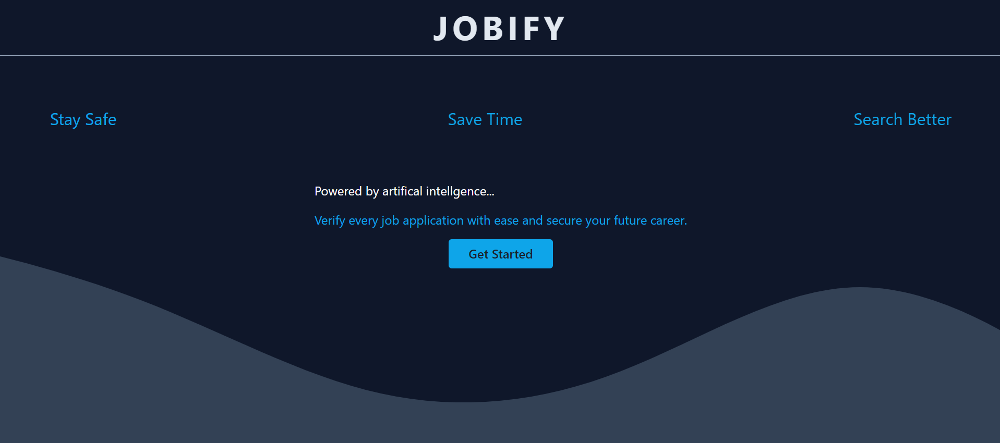

# Jobify

Worried or don't want to waste your time on a job applications that aren't legit? Say hello to Jobify, the website with a neural network built it to handle that work for you.

<p align="center">
  
</p>

## Technologies


## Inspiration
I personally apply to a lot of job applications and it can be really tiresome filtering through the ones that don't appeal me. Further, a certain anxiety can be experienced when sending an application to a company that is relatively unknown. To make this process less stressful and more efficient, I've created a solution called _Jobify_, a website with a neural network that helps detect fraudulent job applications. Something that could help reassure people when they go to apply for jobs and help reduce the damage impersonators or scammers can do.

## What it does
Users submit information regarding a job application they are currently applying for on the website. Once they click the submit button on the `/verify` page, a trained model is loaded in and builds tensors for each entry in the dataset in order to make predictions. Then it relays those predictions back to the user and gives them a percentile of the posting being real or fake.

## How it was built
The core framework of the platform is built in `Typescript`, with the `Next.js` framework providing a robust foundation for its architecture. To ensure seamless, efficient, and visually appealing user experiences, `Chakra UI` was chosen for its component-based styling. In addition, the neural network is built in `TensorFlow` utilizing the `tfjs`, `tfjs-node`, and `universal-sentence-encoder`. The model consist of 3 layers that were trained on the following dataset from Kaggle: https://www.kaggle.com/datasets/shivamb/real-or-fake-fake-jobposting-prediction. Lastly, the application is deployed on `vercel`.

## Challenges
This was my first time working with `Next.js` & `TensorFlow`, the undertaking of learning those technologies was really difficult. There were things I had to scrap such as accepting CSV data for user input, web scraping on the sites that the user was applying to, and storing user input for future training. These were all items I wanted to tackle but I just couldn't, especially due to difficulties of building the neural network. I hadn't had much knowledge on neural networks so that in its own right, was the biggest challenge I faced.

## Accomplishments
Building a neural network, I have had some expose to Natural Language Processing from a class I took last fall but this was my first experience working with networks. The hill to climb was massive, but I overcame it and I can say the network does what is intended (for the *most* part). On top of learning Next.js and getting the application deployed, I'm very proud of what I accomplished this weekend.

## What was learned
How to build neural networks in `TypeScript`, time managing as best as humanly possible to have a complete application at the end. Learned how powerful of a like framework `Next.js` is, I can see why it’s so widely used in industry. Finally, having a deploy application was something I kind of learned on the fly.

## What's next for Jobify
There think there is alot to do for an application like this. Some of the things listed above could be built proceeding this hackathon. The application doesn't just need to verify job applications, maybe it could be expanded to determine if someone's skill set is best fit for the job they are applying to. And things they could possibly be told to stand out. While the current focus is on preventing fraudulent job applications, I believe that the potential of _Jobify_ goes beyond this initial scope.

### Note
The network does take some time to run on `vercel`, this is due to that the fact that the binary of `tjs` is too large to fit on a `vercel` application.

## How to run

First, run the development server, after `npm install`:

```bash
npm run dev
# or
yarn dev
# or
pnpm dev
```

Open [http://localhost:3000](http://localhost:3000) with your browser to see the result.

## Icons & Images
<a href="https://www.flaticon.com/free-icons/network" title="network icons">Network icons created by Dreamstale - Flaticon</a>
